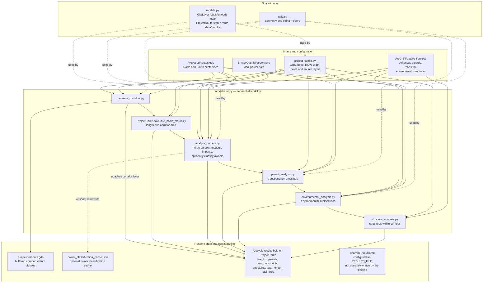

# Project architecture

The project is a sequential, in-process GIS analysis pipeline. `orchestrator.py`
coordinates the workflow; configured route and layer objects carry source
metadata and analysis results between stages.

## Runtime sequence

The orchestrator runs each analysis stage in order across the configured
routes: it generates and persists right-of-way buffers, calculates basic
metrics, then runs parcel, permit, environmental, and structure analyses. The
analyses load GIS layers through `GISLayer`, process spatial data with
GeoPandas/Shapely, and store their results on each mutable `ProjectRoute`
instance.

Owner classification is optional: when configured with an API key and the
OpenAI SDK, parcel analysis classifies unique owner names and caches results
locally. The cache can contain personal owner names.

The configured `RESULTS_FILE` is not currently consumed by the pipeline.
Aside from corridor feature classes and the optional owner cache, results are
not persisted after the Python process exits.
